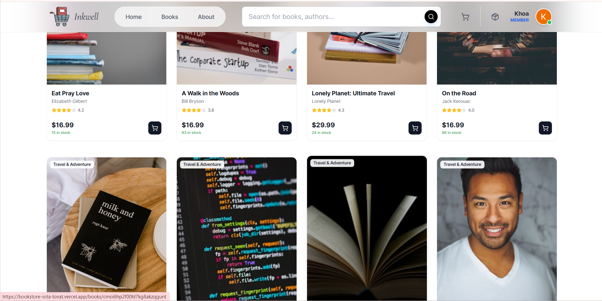
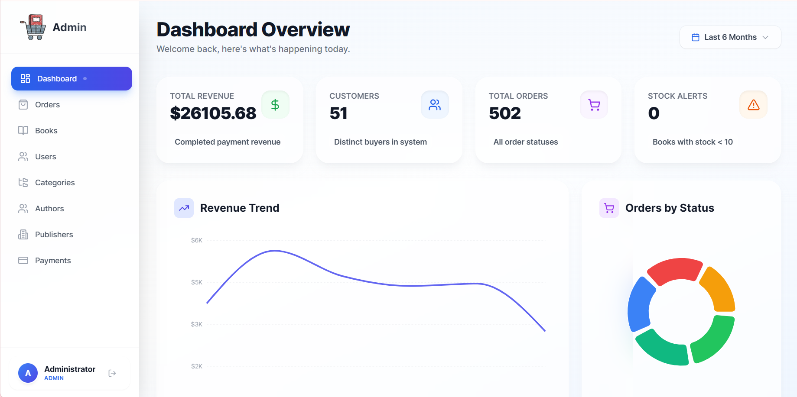

# 📚 BookStore – Full-Stack E-Commerce Platform


## 📖 Introduction
BookStore is a comprehensive full-stack web application designed for online book browsing, purchasing, and order management. It features a robust role-based access control system (User/Admin), a seamless shopping experience from cart to checkout, and a comprehensive administrative dashboard. 

Originally developed as an academic software engineering project (HCMUT), it has been continuously refined, refactored, and optimized to adopt modern industry standards and best practices.

## 👨‍💻 My Role & Contributions
**Role:** Backend Developer (with Full-stack contributions)

While I contributed to the entire full-stack lifecycle, my primary focus was architecting and implementing the **Backend** services:
- **Database Architecture:** Designed a scalable relational schema using **PostgreSQL** and managed migrations with **Prisma ORM** (handling 12 interconnected tables including Users, Orders, Payments, and Ratings).
- **RESTful API Development:** Built secure and efficient APIs using **Node.js, Express 5, and TypeScript** with a modular, domain-driven structure.
- **Authentication & Security:** Implemented dual-auth flows using **JWT** and **Google OAuth 2.0**. Enforced security best practices using `Helmet`, password hashing with `bcryptjs`, and strict payload validation with `Zod`.
- **Payment & Third-party Integrations:** Integrated **Cloudinary** for image uploads, and **Resend** for transactional emails (e.g., password resets).
- **Frontend Integration:** Contributed to the **React/TypeScript** frontend, specifically connecting `TanStack React Query` hooks to the backend APIs, resolving build issues, and building out key user and admin interfaces.

## 🛠 Technology Stack

### Backend (Core Focus)
- **Runtime & Framework:** Node.js, Express 5
- **Language:** TypeScript
- **Database & ORM:** PostgreSQL, Prisma ORM
- **Security & Validation:** JWT, Zod, Helmet, bcryptjs
- **Services:** Stripe API, PayPal SDK, Cloudinary (Images), Resend (Emails)

### Frontend
- **Framework:** React 18 (Vite), TypeScript
- **Styling:** TailwindCSS
- **State Management:** TanStack React Query
- **Routing:** React Router v6
- **Charts:** Recharts (Admin Dashboard)

## ✨ Key Features

### 🛒 Customer Experience

- **Modern Hero Banner & Home Page:** Engaging landing page with a responsive, modern design.
- **Advanced Catalog & Search:** Browse books with dynamic filtering by category, author, and publisher.
- **Cart & Checkout Flow:** Seamless cart management with integrated Stripe/PayPal payment processing.
- **Order Tracking:** Track order status from `PENDING` to `DELIVERED`.
- **Reviews & Ratings:** Customers can leave 1-5 star reviews and vote on others' reviews.
- **User Profile:** Manage personal info, shipping addresses, and upload avatars.

### 📊 Administration & Operations

- **Analytics Dashboard:** Real-time revenue and sales statistics visualized with Recharts.
- **Catalog Management:** Full CRUD capabilities for Books, Categories, Authors, and Publishers.
- **Order Processing:** Update order statuses and track payment confirmations.
- **User Management:** Oversee registered accounts and their roles.

## 📂 Project Structure

```text
bookstore/
├── backend/                # Express & TypeScript Backend
│   ├── prisma/             # Schema, migrations, seed data
│   └── src/
│       ├── config/         # Environment & Third-party configs
│       ├── middleware/     # Auth, error handling, validation
│       ├── modules/        # Domain-driven modules (auth, books, orders, payments, etc.)
│       └── utils/          # Helper functions
│
└── frontend/               # React & Vite Frontend
    └── src/
        ├── components/     # Reusable UI components
        ├── lib/            # API client setup
        ├── pages/          # Application pages & Admin views
        └── styles/         # Tailwind CSS & global styles
```

## 🚀 Installation & Setup

### Prerequisites
- Node.js ≥ 20.x
- PostgreSQL
- npm ≥ 10.x

### Backend Setup
```bash
cd backend
npm install
# Create a .env file with DATABASE_URL, JWT_SECRET, STRIPE_SECRET_KEY, etc.
npx prisma migrate dev      # Apply database migrations
npm run prisma:seed         # Seed initial data
npm run dev                 # Start development server
```

### Frontend Setup
```bash
cd frontend
npm install
# Create a .env file with VITE_API_URL, VITE_STRIPE_PUBLIC_KEY, etc.
npm run dev                 # Start Vite dev server
```

## 🔗 API Overview

The backend uses a modular RESTful architecture:
- `/api/auth` - Authentication, OAuth, and Password Reset
- `/api/books` - Product catalog and filtering
- `/api/categories`, `/api/authors`, `/api/publishers` - Catalog metadata
- `/api/orders` - Order placement and tracking
- `/api/payments` - Stripe and PayPal processing
- `/api/cart` - Cart state management
- `/api/ratings` - User reviews
- `/api/analytics` - Admin reporting endpoints
- `/api/upload` - Image handling via Cloudinary

---
*Developed with ❤️ as a portfolio showcase of modern Full-Stack development practices.*
